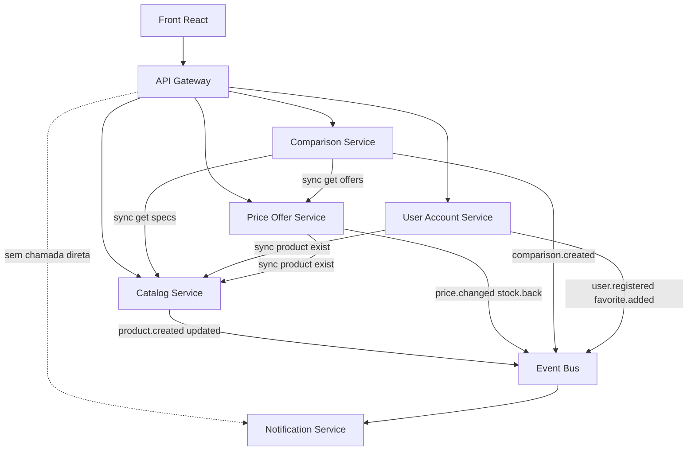

# Plano de migração MSS → domínio NestJS (AllForOne)

## Contexto atual

Hoje o back-end é Express + TypeScript + MongoDB, com 5 MSS de domínio e infra própria:

- **Auth + User** (3001/3002): cadastro/login + perfil separados
- **Catalog** (3003): produto **com** `precoMedio` + `sitesCompra`
- **Review** (3004): avaliações
- **History** (3005): histórico de visualizações
- **Gateway / Event Bus / Request Bus** (10000–10002): HTTP broker custom

Comparação (`/comparar`) é 100% front ([`FRONT-END/project/src/busca/Busca.jsx`](FRONT-END/project/src/busca/Busca.jsx)). Preço vive embutido em [`produto.ts`](back-end/mss/Catalog/catalog/entities/produto.ts). Não há Notification, favoritos nem listas salvas.

NestJS entra em **outra task** — este plano assume Nest como destino e define o que migrar, para onde, e em que ordem (sem scaffolding Nest).

---

## Arquitetura-alvo (fase 1 — núcleo)



### Ownership dos 5 núcleos

1. **Catalog** — fonte da verdade do que existe: categoria, marca, specs, imagens, lançamento. Sem preço nem lojas.
2. **Price/Offer** — ofertas por loja, `precoMedio` derivado, histórico de preço. Taxa de mudança alta = serviço próprio.
3. **Comparison** — recebe N productIds, busca specs + ofertas, monta tabela spec-a-spec com vencedor por critério. Coração da API (hoje só no FE).
4. **User/Account** — unifica Auth+User: cadastro, login, perfil, favoritos, listas de comparação salvas; absorve History atual.
5. **Notification** — só consome eventos; nunca chamado pelo Gateway. Justifica o event bus.

### Fase 2 (depois dos 5) — encaixe, sem implementar agora

- **Search** — índice próprio via eventos do Catalog (+ preço)
- **Review/Rating** — MSS Review atual → Nest
- **Scraper/Ingestion** — publica para Catalog/Price
- **Recommendation** — consome `comparison.created` + histórico
- **Analytics** — consome eventos agregados

Review fica Express até a fase 2. History migra para User/Account na fase 1.

---

## Split de dados (crítico)

**Catalog fica:** `Categoria`, `Produto` sem `precoMedio` / `sitesCompra`.

**Price/Offer recebe** (migrar do seed atual):

- `Offer` — `{ productId, store, price, url, inStock, capturedAt }`
- `PriceSnapshot` — histórico append-only
- `precoMedio` calculado ou materializado no write

Eventos: `offer.upserted`, `price.changed`, `price.dropped`, `stock.back`.

**Comparison (novo):** `POST` com `productIds` → matriz de specs + winners + preço atual. Listas salvas ficam em User/Account.

**User/Account:** credenciais + perfil + `Favorite` + `SavedComparisonList` + `ViewHistory` (substitui History :3005).

**Notification:** preferências/alertas; handlers de `price.dropped` / `stock.back`; resolve destinatários via favoritos (projeção local de `favorite.added` ou request-bus).

---

## Estrutura de pastas-alvo

Substituir `Identity / Catalog / Engagment` por pastas de domínio:

```
back-end/
├── infra/gateway | event-bus | request-bus
├── mss/
│   ├── catalog/
│   ├── price-offer/
│   ├── comparison/
│   ├── user-account/
│   ├── notification/
│   └── (fase2) search | review | scraper | recommendation | analytics
├── shared/
└── api-shared-config.json
```

Convenção Nest por app (na task Nest): `src/modules/<feature>/{controller,service,schema,dto}` + integração com buses.

---

## Estratégia strangler (ordem)

### Fase 0 — Contrato (paralelo à task Nest)

Atualizar [`api-shared-config.json`](back-end/api-shared-config.json): portas, paths (`/ofertas`, `/comparar` no back, `/favoritos`, `/listas`), catálogo de eventos/requests. Gateway continua único entrypoint do front.

### Fase 1 — Catalog limpo + Price/Offer

1. Subir Price/Offer (Nest) com dados migrados de `sitesCompra` / `precoMedio`.
2. Slim Catalog: produto deixa de persistir preço.
3. Gateway **compõe** produto+ofertas no detalhe (FE muda pouco na 1ª onda).
4. Price valida `productId` via `catalog.product.exist`.

**Pronto quando:** detalhe/lista ainda mostram preço; Catalog não persiste oferta.

### Fase 2 — Comparison Service

1. Extrair lógica de [`Busca.jsx`](FRONT-END/project/src/busca/Busca.jsx) para `POST /comparar`.
2. Front só envia IDs e renderiza a resposta.
3. Emitir `comparison.created`.

**Pronto quando:** FE não calcula vencedor.

### Fase 3 — User/Account (merge)

1. Um Nest app absorve Auth + User + History.
2. Migrar DBs `autentification`, `userProfile`, `userProductHistory`.
3. Favoritos + listas salvas.
4. Desligar Auth :3001, User :3002, History :3005.

### Fase 4 — Notification

1. Sem rota pública de negócio no Gateway.
2. Inscrever em `price.dropped` / `stock.back`.
3. Favoritar → preferência implícita de alerta (`favorite.added`).

**Pronto quando:** queda simulada no Price gera alerta (log/inbox).

### Fase 5 — Legado e expansão

Review → Nest; Search / Scraper / Recommendation / Analytics sob demanda; remover pastas Express órfãs.

---

## Impacto no front

- **Catalog+Price:** quase nenhum se Gateway compuser
- **Comparison:** `Busca.jsx` vira cliente de `POST /comparar`
- **User/Account:** mesmas rotas de auth/histórico; novos favoritos/listas
- **Notification:** badge/inbox (pode stub)

Front continua só no Gateway ([`config.jsx`](FRONT-END/project/src/config.jsx)).

---

## Eventos e requests do núcleo

**Events:** `product.created|updated|deleted`, `offer.upserted`, `price.changed|dropped`, `stock.back`, `comparison.created`, `user.registered`, `favorite.added|removed`, `savedList.updated`

**Requests:** `catalog.product.exist|get`, `price.offer.byProduct(s)`, `user.byAuthId`

Notification não entra no request-bus de negócio.

---

## Decisões fixadas

- NestJS por MSS (scaffolding na task Nest)
- Auth+User → um User/Account; History dentro dele
- Review Express até expansão #7
- Comparação sobe para o back
- Preço sai do Catalog na primeira onda
- Gateway compõe produto+preço na transição
- Event bus custom no curto prazo; Notification é o primeiro consumidor puro

---

## Ordem de PRs

1. Config + ownership documentado
2. Price/Offer + Catalog slim + Gateway BFF de detalhe
3. Comparison Nest + FE thin client
4. User/Account Nest (merge) + favoritos/listas
5. Notification + demo de alerta de preço
6. (Opcional) Search → Scraper → Recommendation → Analytics → Review Nest
